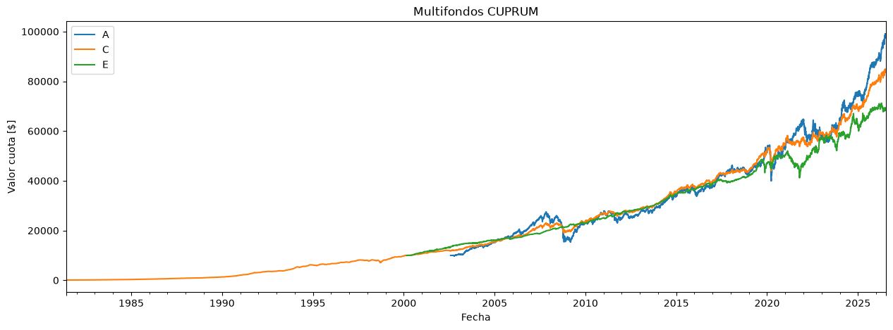
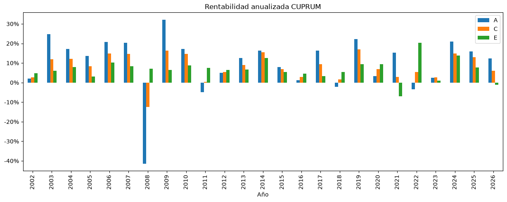

# data_afp

**Valores cuota y patrimonio de los fondos de las AFP de Chile**, descargados
desde la [Superintendencia de Pensiones](https://www.spensiones.cl) y publicados
como CSV listos para usar.

Los datos cubren los cinco tipos de fondo (A, B, C, D y E), desde el inicio de
cada uno (el fondo C parte en 1981) hasta el último día hábil disponible, para
todas las AFP históricas y vigentes (incluida **AFP UNO**).

> **Actualización 2026:** el proyecto se reescribió por completo en Python. La
> descarga ya **no requiere navegador ni Selenium** (antes usaba Ruby +
> `webdrone`): la Superintendencia genera el CSV vía una petición HTTP directa.
> El patrimonio ahora se guarda como entero (antes algunas celdas salían en
> notación científica). Los notebooks de análisis se reemplazaron por el módulo
> `afpdata.analysis`, que genera los gráficos en [`charts/`](charts).

**🌐 Página web:** gráficos y descargas en
[collabmarket.github.io/data_afp](https://collabmarket.github.io/data_afp/).

## Análisis

Gráficos por AFP en [`charts/`](charts): valor cuota multifondos (histórico
completo), rentabilidad anualizada, rentabilidad semanal (últimos 365 días) y
valor cuota / rentabilidad diaria (últimos 60 días). Por ejemplo:





## Descargar los datos

Los archivos están en la carpeta [`data/`](data). Se pueden descargar directo
con estos enlaces (reemplaza `AFP` por la que quieras):

**Valor cuota de una AFP, todos los fondos** — `VC-<AFP>.csv`:

- [CAPITAL](https://raw.githubusercontent.com/collabmarket/data_afp/master/data/VC-CAPITAL.csv)
- [CUPRUM](https://raw.githubusercontent.com/collabmarket/data_afp/master/data/VC-CUPRUM.csv)
- [HABITAT](https://raw.githubusercontent.com/collabmarket/data_afp/master/data/VC-HABITAT.csv)
- [MODELO](https://raw.githubusercontent.com/collabmarket/data_afp/master/data/VC-MODELO.csv)
- [PLANVITAL](https://raw.githubusercontent.com/collabmarket/data_afp/master/data/VC-PLANVITAL.csv)
- [PROVIDA](https://raw.githubusercontent.com/collabmarket/data_afp/master/data/VC-PROVIDA.csv)
- [UNO](https://raw.githubusercontent.com/collabmarket/data_afp/master/data/VC-UNO.csv)

Formatos disponibles en `data/`:

| Archivo | Contenido |
|---|---|
| `VC-<AFP>.csv`  | Valor cuota de una AFP, columnas = fondos A–E |
| `PAT-<AFP>.csv` | Valor patrimonio de una AFP, columnas = fondos A–E |
| `vcf<X>.csv`    | Valor cuota de un fondo (A–E), columnas = AFP |
| `patf<X>.csv`   | Valor patrimonio de un fondo (A–E), columnas = AFP |
| `f<X>.csv`      | Valor cuota **y** patrimonio de un fondo, columnas MultiIndex `(AFP, Item)` |

Todos usan `;` como separador y coma decimal (formato chileno). El valor cuota
va con coma decimal (p. ej. `56128,23`) y el patrimonio como entero en pesos.

## Regenerar / actualizar los datos

El entorno se maneja con [mise](https://mise.jdx.dev) (Python 3.12 + venv
automático, ver [`mise.toml`](mise.toml)):

```bash
mise install          # instala Python y crea el venv
mise run install      # instala pandas, requests, matplotlib

mise run update-data  # descarga en vivo y actualiza data/
mise run charts       # regenera los gráficos en charts/
mise run all          # ambas cosas
```

Sin mise, cualquier Python 3.9+ sirve:

```bash
pip install -r requirements.txt
python -m afpdata                     # actualiza data/
python -m afpdata.analysis            # regenera charts/
```

Opciones útiles:

```bash
python -m afpdata --raw-dir raw       # además guarda los CSV crudos en raw/
python -m afpdata --from-raw raw      # reprocesa desde raw/ sin descargar
python -m afpdata --out-dir otra_ruta # cambia el directorio de salida
python -m afpdata.analysis CUPRUM UNO # gráficos solo de algunas AFP
```

La actualización automática diaria corre en GitHub Actions
([`.github/workflows/update-data.yml`](.github/workflows/update-data.yml)):
descarga los datos, y si cambian, los commitea al repositorio.

## Estructura del código

```
afpdata/
  source.py    Descarga el CSV crudo desde spensiones.cl (HTTP directo)
  parse.py     Parsea el CSV por bloques a un DataFrame ordenado (AFP, Item)
  build.py     Genera todos los CSV de salida en data/
  cli.py       Orquesta descarga → parseo → escritura (python -m afpdata)
  analysis.py  Genera los gráficos por AFP en charts/ (python -m afpdata.analysis)
```

## Fuente

Superintendencia de Pensiones, formulario
[Valores de Cuota y del Patrimonio](https://www.spensiones.cl/apps/valoresCuotaFondo/vcfAFP.php).
Los valores confirmados se publican dentro de las 24 horas del día hábil
siguiente.

## Licencia

MIT.
